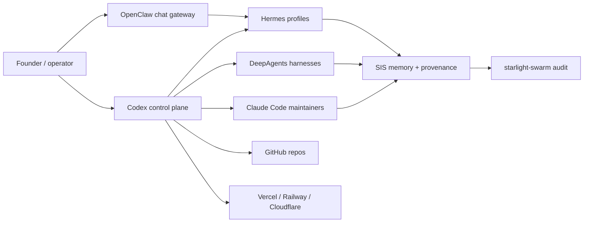

# Starlight Agent Army Architecture

[](https://github.com/frankxai/starlight-agent-army-architecture/actions/workflows/validate.yml)
[](LICENSE)

Starlight-specific implementation playbook for running local and cloud agent armies with Codex as a repo control plane, Hermes profiles as local workers, OpenClaw as a chat gateway, DeepAgents as durable harnesses, and SIS as memory/provenance.

For the neutral architecture layer, see [agentic-architecture-field-guide](https://github.com/frankxai/agentic-architecture-field-guide). For the ecosystem index, see [awesome-agent-operating-systems](https://github.com/frankxai/awesome-agent-operating-systems).

## Topology



## Repo Roles

- [Starlight-Intelligence-System](https://github.com/frankxai/Starlight-Intelligence-System) - memory, provenance, heart checks, local substrate.
- [starlight-swarm](https://github.com/frankxai/starlight-swarm) - dashboard and audit registry.
- [hermes-cockpit](https://github.com/frankxai/hermes-cockpit) - Hermes local operator view.
- [awesome-hermes-agents](https://github.com/frankxai/awesome-hermes-agents) - Hermes-specific resource layer.
- [mcp-doctor](https://github.com/frankxai/mcp-doctor) - MCP and agent environment audits.

## Quickstart

```powershell
git clone https://github.com/frankxai/starlight-agent-army-architecture.git
cd starlight-agent-army-architecture
powershell -ExecutionPolicy Bypass -File scripts/validate-architecture.ps1
```

## Operating Pattern

1. Codex owns repo changes, tests, worktrees, docs, and publish flow.
2. Hermes profiles own ongoing local task lanes and handoffs.
3. OpenClaw exposes selected lanes to chat apps and mobile surfaces.
4. DeepAgents run bounded research or coding harnesses with explicit inputs and outputs.
5. Claude Code can own repo-local maintainer lanes where CLAUDE.md and skills are stronger than Codex rules.
6. SIS records memory, provenance, audit events, and health state.
7. Deployment goes through explicit targets: Vercel for web/API/workflow, Railway for always-on services, Cloudflare for edge/static/Workers.

## Starter Assets

- [Hermes profile topology](configs/hermes-profiles.example.json)
- [MCP trust tiers](configs/mcp-trust-tiers.example.json)
- [Swarm roles](docs/swarm-roles.md)
- [Control-plane workflow](docs/control-plane-workflow.md)
- [AGENTS.md template](templates/AGENTS.md)

## Provenance

Starlight is an implementation pattern layered around upstream tools. Hermes Agent is by Nous Research, OpenClaw is by the OpenClaw project, DeepAgents is by LangChain, Claude Code is by Anthropic, and Codex is by OpenAI.
