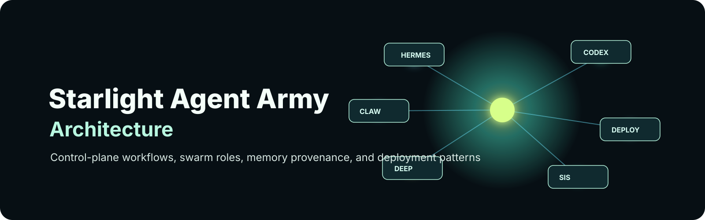
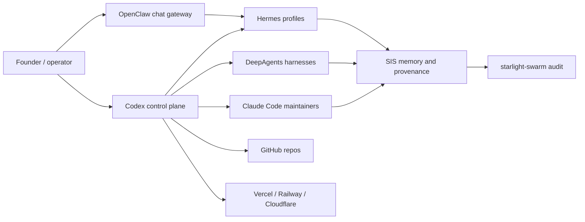

<p align="center">
  
</p>

<h1 align="center">Starlight Agent Army Architecture</h1>

<p align="center">
  <strong>Control-plane workflows, swarm roles, SIS provenance, gateway policy, and deployment recipes for Starlight agent fleets.</strong>
</p>

<p align="center">
  <a href="#quickstart">Quickstart</a> ·
  <a href="docs/swarm-roles.md">Swarm Roles</a> ·
  <a href="docs/health-checks.md">Health</a> ·
  <a href="docs/deployment-recipes.md">Deploy</a> ·
  <a href="configs/hermes-profiles.example.json">Configs</a>
</p>

[](https://github.com/frankxai/starlight-agent-army-architecture/actions/workflows/validate.yml)
[](LICENSE)
[](docs/swarm-roles.md)
[](configs/hermes-profiles.example.json)

> The Starlight implementation playbook for running local and cloud agent armies with Codex as the repo control plane, Hermes profiles as durable workers, OpenClaw as the chat/mobile gateway, DeepAgents as long-running harnesses, Claude Code as a maintainer lane, and SIS as memory/provenance.

For the neutral architecture layer, see [agentic-architecture-field-guide](https://github.com/frankxai/agentic-architecture-field-guide). For the ecosystem index, see [awesome-agent-operating-systems](https://github.com/frankxai/awesome-agent-operating-systems).

## What This Repo Owns

| Owns | Does not own |
| --- | --- |
| Starlight operating model | Hermes/OpenClaw/DeepAgents/Claude/Codex upstream behavior |
| Profile topology | Vendor documentation |
| Swarm role contracts | Generic awesome-list curation |
| SIS memory/provenance policy | Secrets or credentials |
| Deployment recipes | Production hosting for your fleet |
| **Agent Cards + ADLC + brand portfolio SSOT** | Brand marketing sites' full UI implementation |

## Agent Portfolio + ADLC (2026-08-09)

Single strategy home for faced agents across GenCreator, FrankX, Starlight ops, Arcanea (next), and AI CoE.

| Artifact | Path |
| --- | --- |
| Brand decisions | [docs/agent-portfolio/BRAND_AGENT_PORTFOLIO.md](docs/agent-portfolio/BRAND_AGENT_PORTFOLIO.md) |
| Agent Development Life Cycle | [docs/adlc/ADLC.md](docs/adlc/ADLC.md) |
| 10h Queen execution | [docs/execution/10H_QUEEN_SWARM_PLAN.md](docs/execution/10H_QUEEN_SWARM_PLAN.md) |
| Next 10h backlog | [docs/execution/NEXT_10H.md](docs/execution/NEXT_10H.md) |
| Card schema | [schemas/agent-card/agent-card.schema.json](schemas/agent-card/agent-card.schema.json) |
| Host cards | `cards/hosts/` (Gen-Ω, FrankX Concierge, Starlight Operator) |
| Specialists | `cards/specialists/` (GenCreator L2 set) |
| KB packs | `kb-packs/` |
| Web load contract | [docs/execution/WEB_LOAD_CONTRACT.md](docs/execution/WEB_LOAD_CONTRACT.md) |

```powershell
python scripts/validate_agent_cards.py
python scripts/run_eval_suite.py
```

**Law:** identity lives in cards; Vercel AI SDK is product UI; Hermes is private L4–L5 ops; OpenAI/Google ADKs are optional backends only.

## Quickstart

| Need | Start |
| --- | --- |
| Define swarm roles | [Swarm roles](docs/swarm-roles.md) |
| Run a repo-control workflow | [Control-plane workflow](docs/control-plane-workflow.md) |
| Configure gateway policy | [OpenClaw gateway example](configs/openclaw-gateway.example.json) |
| Configure research harness | [DeepAgents harness example](configs/deepagents-harness.example.yaml) |
| Verify machine readiness | [Health checks](docs/health-checks.md) |

```powershell
git clone https://github.com/frankxai/starlight-agent-army-architecture.git
cd starlight-agent-army-architecture
powershell -ExecutionPolicy Bypass -File scripts/validate-architecture.ps1
```

Then read:

1. [Swarm roles](docs/swarm-roles.md)
2. [Control-plane workflow](docs/control-plane-workflow.md)
3. [SIS memory and provenance](docs/sis-memory-provenance.md)
4. [Health checks](docs/health-checks.md)
5. [Deployment recipes](docs/deployment-recipes.md)

## Topology



## Operating Pattern

1. Codex owns repo changes, tests, worktrees, docs, and publish flow.
2. Hermes profiles own ongoing local task lanes and handoffs.
3. OpenClaw exposes selected lanes to chat apps and mobile surfaces.
4. DeepAgents run bounded research or coding harnesses with explicit inputs and outputs.
5. Claude Code can own repo-local maintainer lanes where CLAUDE.md and skills are stronger than Codex rules.
6. SIS records memory, provenance, audit events, and health state.
7. Deployment goes through explicit targets: Vercel for web/API/workflow, Railway for always-on services, Cloudflare for edge/static/Workers.

## Control Boundaries

| Boundary | Rule |
| --- | --- |
| Repo writes | Codex or Claude Code only, in scoped worktrees/branches |
| Chat-originated tasks | OpenClaw routes; it does not get broad write authority by default |
| Long research | DeepAgents may write reports; implementation happens in a repo-control lane |
| Memory | Store decisions, sources, summaries, and audit state; never raw secrets |
| Deployment | Human-approved target, environment, and rollback condition |

<details>
<summary><strong>Default Starlight rule</strong></summary>

Agents can draft, inspect, summarize, and propose. Repo writes, gateway privileges, memory persistence, and deployments require a named lane, scope, and verification command.

</details>

## Starter Assets

- [Hermes profile topology](configs/hermes-profiles.example.json)
- [OpenClaw gateway roles](configs/openclaw-gateway.example.json)
- [DeepAgents harness roles](configs/deepagents-harness.example.yaml)
- [MCP trust tiers](configs/mcp-trust-tiers.example.json)
- [Codex maintainer template](templates/codex-maintainer.md)
- [AGENTS.md template](templates/AGENTS.md)

## Related Starlight Repositories

- [Starlight-Intelligence-System](https://github.com/frankxai/Starlight-Intelligence-System) - memory, provenance, heart checks, local substrate.
- [starlight-swarm](https://github.com/frankxai/starlight-swarm) - dashboard and audit registry.
- [hermes-cockpit](https://github.com/frankxai/hermes-cockpit) - Hermes local operator view.
- [awesome-hermes-agents](https://github.com/frankxai/awesome-hermes-agents) - Hermes-specific resource layer.
- [mcp-doctor](https://github.com/frankxai/mcp-doctor) - MCP and agent environment audits.

## Provenance

Starlight is an implementation pattern layered around upstream tools. Hermes Agent is by Nous Research, OpenClaw is by the OpenClaw project, DeepAgents is by LangChain, Claude Code is by Anthropic, and Codex is by OpenAI.
