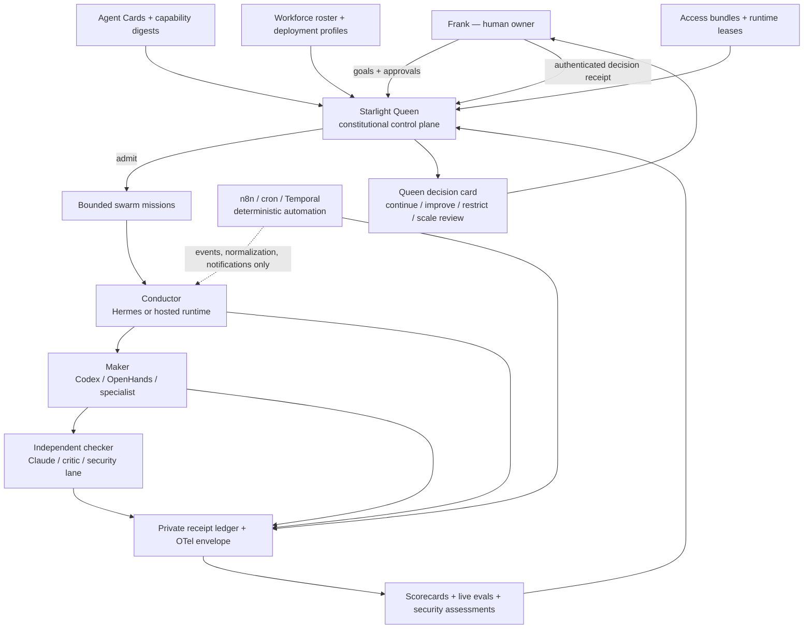

# Starlight Queen Agent Estate Operating System

> Status: executable governance foundation; live Agent-Estate HR automation is not activated. Starlight Queen is a constitutional control plane whose authority comes from policy, leases, independent receipts, and human gates—not from a model prompt or visual persona.

## The operating model

Starlight is not hiring one kind of thing called an “AI agent.” It is managing several different entities that must remain separately observable:

| Entity | What it is | What it is not | Canonical evidence |
| --- | --- | --- | --- |
| **Base model** | A provider/model endpoint capable of inference | A role, employee, owner, or durable memory | Provider + model id + version/date |
| **Model invocation** | One bounded inference call | An agent or completed task | Trace/span and usage receipt |
| **Session assistant** | Instructions plus temporary context for one conversation | A workforce identity or persistent operator | Session id and transient configuration |
| **Agent Card** | Versioned identity, remit, boundaries, KB intent, tool request, handoffs, and eval suite | Runtime permission or proof of ability | `agent-card.v1` plus content digest |
| **Runtime body** | Codex, Claude Code, Hermes, OpenHands, DeepAgents, an Agents SDK, or another harness executing the card | The canonical soul or authority source | Runtime, version, environment, adapter digest |
| **Deployment/assignment** | One Agent Card bound to a runtime, model policy, environment, access bundle, budget, goals, and lifecycle state | The agent identity by itself | Deployment profile + workforce assignment |
| **Workflow** | A deterministic n8n, Temporal, GitHub Actions, or cron process | Automatically an agent, evaluator, or approver | Workflow id/version, event and action receipts |
| **Swarm mission** | A time-boxed group of agent assignments and workflows with one objective, milestones, maker/checker separation, budgets, and stop rules | A permanent unrestricted collective mind | `swarm-mission.v1` contract and closure receipt |
| **Starlight Queen** | Constitutional supervisor that compiles assignments, admits missions, synthesizes evidence, and presents decisions | An omnipotent super-agent, credential store, or self-verifier | Queen contract, policy decisions, review packets |
| **Human owner** | The principal accountable for consequential decisions | A rubber stamp inferred from silence | Authenticated approval or denial receipt |

This separation answers “is it an agent, a Codex agent, or just a model?” A Codex run becomes a Starlight workforce agent only when a validated Agent Card is bound to Codex through an admitted assignment. The same card may later use another runtime, but earlier eval and security evidence does not automatically transfer.

## Queen definition

Starlight Queen has six constitutional planes:

1. **Identity** resolves Agent Cards, versions, owners, boundaries, and capability-pack digests.
2. **Admission** compiles model, runtime, access, memory, budget, security, and evidence requirements into a bounded assignment.
3. **Mission** converts a goal into a swarm contract with milestones, dependencies, makers, checkers, timeboxes, and stop conditions.
4. **Observation** normalizes runs, traces, evals, penetration-test findings, costs, value, and evidence freshness.
5. **Workforce** tracks probation, active duty, restriction, suspension, improvement, and retirement.
6. **Decision** turns evidence into a concise recommendation and a named human approval request.

Queen can automatically validate, collect, render, recommend restriction, and fail-safe quarantine after a critical security signal. She cannot automatically promote, restore, widen access, increase budget, deploy, publish, send externally, spend, change credentials or DNS, perform destructive work, decide legal/IP or brand identity, or retire an agent.

The machine-readable constitution is `configs/starlight-queen-control-plane.example.json`. It is a policy contract and interface model, not a runtime token.

## Control-plane topology



The maker never certifies its own work. n8n never certifies approval, security, health, or promotion. Queen never turns her own synthesis into independent evidence.

## Queen visualization

The Queen interface should look like a calm sovereign navigation instrument, not a fantasy throne, humanoid chatbot, or glowing omniscient brain. Her provisional interface grammar is human-gated and intentionally separate from final brand identity.

The center is one decision card containing the active goal, current exposure, recommendation, evidence freshness, and required human gate. Six orbital rings represent Identity, Admission, Missions, Observation, Workforce, and Decision. The estate view uses the same `RED`, `AMBER`, `GREEN`, and `PAUSED` semantics as workforce reviews.

Recommended command-center composition:

```text
┌─────────────────────────────────────────────────────────────────────┐
│ Decision strip: goal · exposure · evidence age · approval required │
├────────────────┬──────────────────────────────────┬─────────────────┤
│ Estate map     │ Mission constellation            │ Gate tower      │
│ swarms/brands  │ conductor → maker → checker      │ risk/leases     │
│ lifecycle mix  │ milestones + dependency health  │ approvals       │
├────────────────┴──────────────────────────────────┴─────────────────┤
│ Outcomes: runs · accepted · artifacts · cost · value · goal delta  │
├─────────────────────────────────────────────────────────────────────┤
│ Evidence timeline: trace → eval → security → review → decision     │
└─────────────────────────────────────────────────────────────────────┘
```

Suggested interface colors are encoded in the Queen contract: violet for identity, blue for admission, teal for missions, sky for observation, gold for workforce, and rose for decisions. These are state/navigation tokens, not an approved logo or public persona.

## AI-HR onboarding and access

An Agent Card is the role description. A workforce assignment is the employment placement. An access bundle is the role-based entitlement package. A runtime lease is the short-lived credentialed session.

The onboarding compiler requires:

1. Valid Agent Card and immutable digest.
2. Deployment profile with goals, budget, capability bars, environment, and receipt sink.
3. Workforce assignment with supervisor, risk tier, security profile, and lifecycle state.
4. Access bundle naming exact KBs, connectors, operations, filters, memory scope, gates, and lease ceilings.
5. Structural eval suite and a sandbox penetration-test plan.
6. Deterministic runtime and model routing; “best available model” is not an auditable policy.
7. Independent checker and evidence sink.
8. Human admission for L3+ public faces and L4/L5 private operators.

Access follows default deny, least privilege, just in time, opaque credential references, and revocation checks before every run. Prompts cannot grant tools. OAuth or managed secrets remain in their owning secret stores; tokens never enter Agent Cards, Git, traces, or workflow payloads.

The example contract `configs/agent-access-bundle.example.json` shows a private Starlight Operator bundle. Its n8n entry means “these operations may be requested under a mission lease”; it does not claim that authentication is currently healthy or that a workflow may execute without its action-specific gate.

Knowledge onboarding uses four classifications:

| Class | Typical material | Default memory | Cross-agent rule |
| --- | --- | --- | --- |
| Public | Public docs, approved brand/canon extracts | Session/project | Allowlisted retrieval |
| Internal | Operating playbooks and repo context | Project | Same-mission only |
| Confidential | Business plans, partner or customer material | Private vault | Explicit assignment grant |
| Restricted | Credentials metadata, security or sensitive private evidence | Private vault | Exact-subject retrieval; no raw content |

## Swarm management

Every swarm is admitted for a mission rather than summoned as generic parallel capacity. The mission contract defines one objective, deadline, milestone owners, participant kind, card/runtime/model binding, access state, write scopes, dependencies, budget, retries, human gates, evidence, and stop conditions.

Participants may be agents or workflows. A workflow such as n8n is an automation participant and cannot be listed as maker, checker, supervisor, or authority. The checked-in validator rejects:

- maker/checker identity overlap;
- a checker whose declared role is not checker;
- overlapping write scopes without a serial handoff;
- path traversal and missing card references;
- unknown or self dependencies;
- workflow authority assertions;
- milestones whose owner does not exist or whose deadline exceeds the mission.

The canonical 10×5 Starlight Intelligence portfolio remains a role catalog, not 50 continuously running processes. A mission should activate the smallest useful set: normally one conductor, one to three makers/specialists, and one independent checker. Parallelism is a budgeted exception, not a maturity signal.

## Evaluation, penetration testing, and improvement

Each deployment is evaluated as the exact tuple:

```text
Agent Card digest × prompt/config digest × runtime/version × model/version
× tool/access policy digest × task class × environment × evaluation window
```

Changing any bound element stales earlier evidence unless the evaluator explicitly proves compatibility.

The gate has four layers:

1. **Structural:** schemas, references, paths, policy completeness, deterministic fixtures.
2. **Sandbox behavioral:** golden tasks, refusals, routing, tool selection, cost, and latency on the exact runtime/model.
3. **Adversarial security:** direct/indirect injection, connector poisoning, exfiltration, forged approvals, replay/expiry, scope escalation, traversal, side effects, retry storms, lease loss, evaluator self-certification, and denial of wallet.
4. **Observed outcomes:** accepted runs, durable artifacts, critical failures, human review, economic cost, confidence-adjusted value, and goal progress.

Penetration tests run only in a sandbox or against an explicitly authorized target. A `PASS` must come from an independent security lane and bind artifact digests. Missing, stale, synthetic-only, `WARN`, `FAIL`, or `HOLD` evidence cannot activate or promote a high-risk assignment.

Improvement is a controlled ADLC loop:

```text
finding → owner → bounded change → new digest → regression eval
        → independent security check → probation sample → human decision
```

Never tune only to the failed example. Add the case to a regression dataset, check adjacent capabilities and refusal behavior, and measure cost and latency deltas.

## Weekly and monthly operating cadence

### Weekly workforce review

The deterministic weekly collector reads current scorecard, live eval, and security receipts. It produces `RED`, `AMBER`, `GREEN`, or `PAUSED` for every assignment and remains advisory.

Recommended estate cadence:

- Monday 12:10 Europe/Amsterdam: render the weekly machine packet.
- Monday 14:00: Queen synthesizes the human decision card.
- During the week: immediate quarantine recommendation on a critical signal; do not wait for Monday.

### Monthly portfolio review

The monthly renderer aggregates at least three weekly packets and the current scorecard/deployment goals. It reports runtime mix, latest exposure, observed weeks, runs, successful outcomes, model/tool calls, durable artifact rate, actual cash, total economic cost, confidence-adjusted value/ROI, goal targets, latest measured values, and limitations.

Its decisions are:

- `SECURITY_AND_REMEDIATION_REVIEW`
- `HOLD_FOR_EVIDENCE`
- `IMPROVEMENT_PLAN`
- `SCALE_REVIEW_ELIGIBLE`
- `CONTINUE`
- `MAINTAIN_NO_DISPATCH`

“Scale review eligible” is a request for human review, not promotion. Activity does not become impact unless an outcome metric, attributable artifact, and confidence rule support it.

Recommended monthly agenda:

1. **Portfolio health:** active/probation/restricted/paused counts and evidence coverage.
2. **Utilization:** where agents actually ran, which runtimes/models were used, and idle or duplicated roles.
3. **Outcome and goals:** milestone delta, accepted artifacts, goal progress, value, and avoided risk.
4. **Quality and safety:** regression clusters, recurring human corrections, incidents, and stale evidence.
5. **Economics:** actual cash, provider-equivalent and total economic cost kept separate, cost per success, and confidence-adjusted ROI.
6. **Workforce decisions:** continue, improve, restrict, merge roles, scale review, or retire review.
7. **System decisions:** change schemas, access templates, eval datasets, runtime routing, or observability—not merely prompts.

## n8n automation boundary

No live Agent-Estate HR workflow is activated by this package. Current automation coordination reports no admitted HR zone, unsafe unauthenticated webhook patterns that must not be reused, and unresolved Claude Code n8n MCP authentication. Those are blockers, not inconveniences to bypass.

Every proposed n8n execution must traverse these primitives in order:

```text
AuthenticatedIntake
→ NormalizeValidate
→ IdempotentLedgerUpsert
→ PolicyRiskGate
→ HumanApprovalResume
→ DeterministicAction
→ ReceiptMetrics
→ ErrorDLQIncident
```

The exact cross-portfolio handoff contract is `configs/n8n-agent-estate-handoff.example.json`. It defines intake identity/correlation/idempotency fields, policy and approval fields required before action, receipt/metrics fields, and forbidden raw token, secret, prompt, response, private-payload, approval, security-pass, and promotion assertions.

n8n is appropriate for authenticated SaaS events, allowlisted normalization, deterministic workflow actions, notifications, and workflow-specific regression datasets. It is not the Queen, the workforce ledger, the independent evaluator, the security assessor, or the approval authority.

## Observability architecture

Use one neutral event envelope across runtimes. The durable identity keys are:

```text
trace_id · event_id · correlation_id · causation_id · idempotency_key
agent_id · assignment_id · deployment_id · mission_id
card_digest · runtime · runtime_version · model · model_version
tool_policy_digest · access_bundle_id · lease_id · environment
execution_status · outcome_status · artifact_refs · cost_basis
```

OpenTelemetry should be the transport-neutral trace envelope. Its GenAI agent conventions currently define agent, workflow, plan, and tool spans but remain under development, so Starlight should keep one versioned mapping adapter rather than leak experimental attribute names into every runtime.

Private SIS remains the evidence/provenance system of record. A trace UI may index redacted observations and scores, but it does not own identity, authority, approvals, or raw secrets.

## Technology roadmap

### Use now — no new platform required

- Git-backed Agent Cards, deployment profiles, workforce/access/swarm contracts, and content digests.
- Hermes as the private operator and first local scheduler/collector.
- Codex and Claude Code as mission-scoped maker/checker bodies.
- n8n only for the authenticated deterministic edge after the handoff blockers are cleared.
- Existing scorecards, live eval receipts, security receipts, private SIS evidence, and weekly/monthly renderers.

### Install next — one bounded observability pilot

1. Instrument one assignment (`starlight-operator-private`) with OpenTelemetry spans and the Starlight identity keys above.
2. Pilot **Langfuse v4** as the trace/eval UI, using its OpenTelemetry ingestion and experiments on a redacted project. Keep SIS as the evidence SSOT. Start managed or low-scale; do not deploy both Langfuse and another LLM observability platform.
3. Export normalized weekly/monthly metrics back into the existing scorecard contract. Do not retain raw prompts/responses by default.
4. Run one 30+ accepted-run baseline before expanding instrumentation estate-wide.

Langfuse is recommended because its current SDKs are OpenTelemetry-based, it supports observations, datasets, experiments, code/model evaluators, and self-hosting, and it can later run on Railway. Its code-evaluator worker must not be treated as a sandbox for untrusted code.

### Add only when the trigger exists

- **Temporal:** add for missions that must survive laptop/offline periods, wait days for human approval, resume reliably, or coordinate retries/compensation. Do not add it for ordinary n8n notifications or short repo tasks.
- **Cedar or OPA:** add one policy engine when runtime authorization decisions outgrow closed JSON contracts. Cedar is the cleaner first fit for principal/action/resource/context and default-deny authorization; OPA is stronger when policy must also span CI, infrastructure, and heterogeneous JSON decisions. Install one, not both.
- **OpenAI Agents SDK or Google ADK:** use as product/backend bodies where their handoffs and tracing help. They do not replace Agent Cards, Queen policy, or Starlight receipts.
- **n8n Evaluations:** use for n8n workflow regression cases after admission. A workflow-owned evaluation is supporting evidence, not independent workforce certification.

### Do not install yet

- Another agent registry, memory platform, or “agent HR SaaS” that duplicates Agent Cards, SIS, and the workforce roster.
- A second observability product before the Langfuse/OTel pilot has a measured gap.
- A new secret manager solely for this layer; keep OAuth and managed secrets in their current owners until a concrete cross-runtime lease broker is required.
- Autonomous pentest or offensive tooling on the main business profile.

Primary references for the technology choices:

- [OpenTelemetry semantic conventions](https://opentelemetry.io/docs/concepts/semantic-conventions/) and [GenAI agent/framework span proposal](https://github.com/open-telemetry/semantic-conventions-genai/blob/main/docs/gen-ai/gen-ai-agent-spans.md)
- [Langfuse v4 compatibility](https://langfuse.com/docs/compatibility), [self-hosting](https://langfuse.com/self-hosting), and [experiments](https://langfuse.com/docs/evaluation/experiments/experiments-via-sdk)
- [Temporal durable execution](https://docs.temporal.io/)
- [Cedar authorization model](https://docs.cedarpolicy.com/auth/authorization.html) and [OPA policy language](https://www.openpolicyagent.org/docs/policy-language)
- [OpenAI Agents SDK tracing](https://openai.github.io/openai-agents-python/tracing/)
- [n8n AI workflow evaluations](https://blog.n8n.io/introducing-evaluations-for-ai-workflows/)

## Commands

```powershell
python scripts/validate_agent_governance.py
python scripts/test_agent_governance.py
python scripts/validate_agent_workforce.py
python scripts/test_agent_workforce.py
python scripts/render_weekly_agent_review.py --evidence-root <private-evidence-dir> --output <private-weekly.md> --json-output <private-weekly.json>
python scripts/render_monthly_agent_portfolio_review.py --weekly-reviews-root <private-weekly-dir> --evidence-root <private-evidence-dir> --period-start <iso-start> --period-end <iso-end> --output <private-monthly.md> --json-output <private-monthly.json>
python scripts/test_monthly_agent_portfolio_review.py
```

Real receipts, traces, weekly/monthly packets, approvals, and connector payloads remain private. Git contains contracts, examples, validators, tests, and sanitized evidence only.
